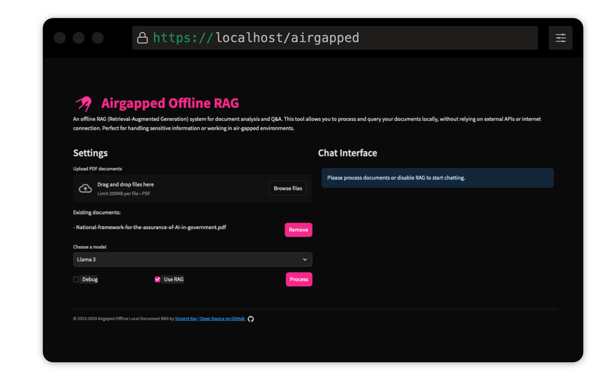

# Airgapped Offline RAG

This project by [Vincent Koc](https://github.com/vincentkoc) implements a Retrieval-Augmented Generation (RAG) based Question-Answering system for documents. It uses Llama 3, Mistral, and Gemini models for local inference with LlaMa c++, langchain for orchestration, chromadb for vector storage, and Streamlit for the user interface.



## Table of Contents
- [Airgapped Offline RAG](#airgapped-offline-rag)
  - [Table of Contents](#table-of-contents)
  - [Setup](#setup)
  - [Running the Application](#running-the-application)
    - [Locally](#locally)
    - [Using Docker](#using-docker)
  - [Usage](#usage)
  - [Configuration](#configuration)
  - [Features](#features)
    - [Supported Features](#supported-features)
    - [Future Features](#future-features)
  - [Contributing](#contributing)
  - [License](#license)
  - [Acknowledgments](#acknowledgments)

## Setup

1. **Ensure Python 3.9 is installed**: You can use `pyenv`:
   ```
   pyenv install 3.9.16
   pyenv local 3.9.16
   pyenv rehash
   ```

2. **Create a virtual environment and install dependencies**:
   ```
   make setup
   ```

3. **Download Models**: Download the Llama 3 (8B) and Mistral (7B) models in GGUF format and place them in the `models/` directory. `TheBloke` on Hugging Face has shared the models [here](https://huggingface.co/TheBloke):
   - [Mistral-7B-Instruct-v0.2-GGUF](https://huggingface.co/TheBloke/Mistral-7B-Instruct-v0.2-GGUF/blob/main/mistral-7b-instruct-v0.2.Q3_K_L.gguf)
   - [LLaMA-Pro-8B-Instruct-GGUF](https://huggingface.co/TheBloke/LLaMA-Pro-8B-Instruct-GGUF/blob/main/llama-pro-8b-instruct.Q3_K_L.gguf)

    The models from `unsloth` have also been tested and can be found [here](https://huggingface.co/unsloth):
    - [Gemma-2-2b-it.q2_k.gguf](https://huggingface.co/unsloth/gemma-2-it-GGUF/blob/main/gemma-2-2b-it.q2_k.gguf)
    - [Llama-3.2-3B-Instruct-Q2_K.gguf](https://huggingface.co/unsloth/Llama-3.2-3B-Instruct-GGUF/blob/main/Llama-3.2-3B-Instruct-Q2_K.gguf)

4. **Qdrant Sentence Transformer Model**: This will be downloaded automatically on the first run. If running the airgapped RAG locally, it's best to run the codebase with internet access initially to download the model.

## Running the Application

### Locally
```
make run
```

### Using Docker
```
make docker-build
make docker-run
```

## Usage

1. **Upload PDF documents** using the file uploader.
2. **Select the model** you want to use (e.g., Mistral).
3. **Enter your question** in the text input.
4. Click **"Generate Answer"** to get a response based on the document content.

## Configuration

Adjust settings in `config.yaml` to modify model paths, chunk sizes, and other parameters.

## Features

### Supported Features
- [x] Local inference with Llama C++
- [x] Model support for LLaMA 3 (3 and 3.1)
- [x] Model support for Mistral
- [x] Model support for Gemini
- [x] Support for quantized models
- [x] Document upload and processing
- [x] Question-Answering system
- [x] Sentence Transformer Model for Vector Storage
- [x] Integration with Streamlit for UI
- [x] Support for streaming responses

### Future Features
- [ ] Integration with additional models (coming soon)
- [ ] Support non-PDF documents (coming soon)
- [ ] Support for image documents (coming soon)
- [ ] Support for visualizing embeddings (coming soon)
- [ ] Support for chat history (coming soon)
- [ ] Enhanced user interface (coming soon)
- [ ] Support for multi-modal documents (coming soon)
- [ ] Exporting and importing RAG configurations (coming soon)
- [ ] Exposing a REST API (coming soon)
- [ ] Observability (coming soon)

## Contributing

Contributions are welcome! Please fork the repository and submit a pull request. For major changes, please open an issue first to discuss what you would like to change.

## License

This project is licensed under the GNU General Public License v3.0 (GPLv3). See the [LICENSE](LICENSE) file for details.

This means:
- You can freely use, modify, and distribute this software.
- If you modify or extend this software, you must release your changes under the GPL.
- You must include the original copyright notice and the full text of the GPL license.
- There's no warranty for this free software.

For more information, visit [GNU GPL v3](https://www.gnu.org/licenses/gpl-3.0.en.html).

## Acknowledgments

- Thanks to [TheBloke](https://huggingface.co/TheBloke) and [unsloth](https://huggingface.co/unsloth) for sharing the quantized models.
- This project uses various open-source libraries. See [requirements.txt](requirements.txt) for details.
